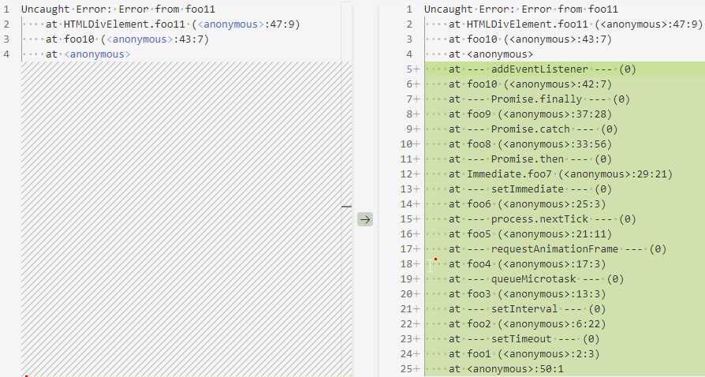
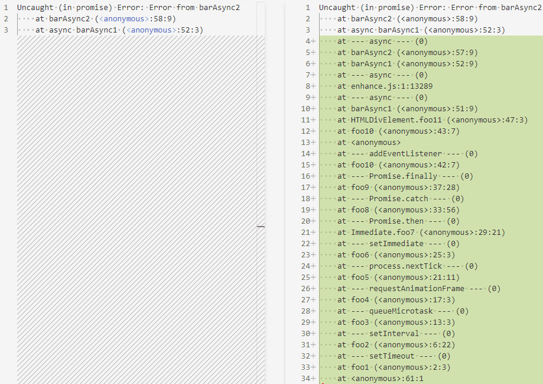
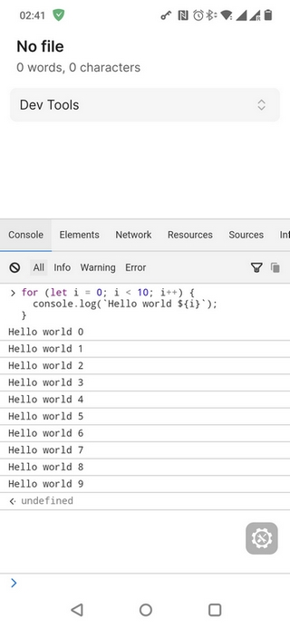

# Advanced Debug Mode

This is a plugin for [Obsidian](https://obsidian.md/) that enhances Obsidian debug mode.

## Features

### Obsidian Debug mode

The plugin adds an easy way to switch Obsidian debug mode on/off. When active, inline source maps will not be stripped from loaded plugins.

### Long stack traces

Error stack traces are usually very limited and stack frames for function like `setTimeout` or `addEventListener` are usually not included, so sometimes it's difficult to find the root cause of the error.

The plugin tries to preserve long stack traces as much as possible.



```js
function foo1() {
  setTimeout(foo2, 100);
}

function foo2() {
  const intervalId = setInterval(foo3, 100);
  setTimeout(() => {
    clearInterval(intervalId);
  }, 150);
}

function foo3() {
  queueMicrotask(foo4);
}

function foo4() {
  requestAnimationFrame(foo5);
}

function foo5() {
  process.nextTick(foo6);
}

function foo6() {
  setImmediate(foo7);
}

function foo7() {
  Promise.resolve().then(foo8);
}

function foo8() {
  Promise.reject(new Error('Error from Promise')).catch(foo9);
}

function foo9() {
  Promise.resolve().finally(foo10);
}

function foo10() {
  const div = createDiv();
  div.addEventListener('click', foo11);
  div.click();
}

function foo11() {
  throw new Error('Error from foo11');
}

foo1();
```

Without the plugin you get the error in the console

```text
Uncaught Error: Error from foo11
    at HTMLDivElement.foo11 (<anonymous>:47:9)
    at foo10 (<anonymous>:43:7)
    at <anonymous>
```

With the plugin you get

```text
Uncaught Error: Error from foo11
    at HTMLDivElement.foo11 (<anonymous>:47:9)
    at foo10 (<anonymous>:43:7)
    at <anonymous>
    at --- addEventListener --- (0)
    at foo10 (<anonymous>:42:7)
    at --- Promise.finally --- (0)
    at foo9 (<anonymous>:37:28)
    at --- Promise.catch --- (0)
    at foo8 (<anonymous>:33:56)
    at --- Promise.then --- (0)
    at Immediate.foo7 (<anonymous>:29:21)
    at --- setImmediate --- (0)
    at foo6 (<anonymous>:25:3)
    at --- process.nextTick --- (0)
    at foo5 (<anonymous>:21:11)
    at --- requestAnimationFrame --- (0)
    at foo4 (<anonymous>:17:3)
    at --- queueMicrotask --- (0)
    at foo3 (<anonymous>:13:3)
    at --- setInterval --- (0)
    at foo2 (<anonymous>:6:22)
    at --- setTimeout --- (0)
    at foo1 (<anonymous>:2:3)
    at <anonymous>:50:1
```

#### Async long stack traces

Async long stack traces are the traces for async functions.

```js
async function foo() {
  await bar();
}
```

> [!WARNING]
>
> The plugin adds async long stack traces only on desktop. Adding it to mobile is impossible due to the current JavaScript Engine limitations.
>
> Async long stack traces might contain some duplicates.
>
> When async long stack traces are enabled, the autocompletion in DevTools console stops working. It seems to be a bug in Electron.



```js
function foo1() {
  setTimeout(foo2, 100);
}

function foo2() {
  const intervalId = setInterval(foo3, 100);
  setTimeout(() => {
    clearInterval(intervalId);
  }, 150);
}

function foo3() {
  queueMicrotask(foo4);
}

function foo4() {
  requestAnimationFrame(foo5);
}

function foo5() {
  process.nextTick(foo6);
}

function foo6() {
  setImmediate(foo7);
}

function foo7() {
  Promise.resolve().then(foo8);
}

function foo8() {
  Promise.reject(new Error('Error from Promise')).catch(foo9);
}

function foo9() {
  Promise.resolve().finally(foo10);
}

function foo10() {
  const div = createDiv();
  div.addEventListener('click', foo11);
  div.click();
}

function foo11() {
  barAsync1();
}

async function barAsync1() {
  await sleep(50);
  await barAsync2();
}

async function barAsync2() {
  await sleep(50);
  throw new Error('Error from barAsync2');
}

foo1();
```

Without the plugin you get the error in the console

```text
Uncaught (in promise) Error: Error from barAsync2
    at barAsync2 (<anonymous>:58:9)
    at async barAsync1 (<anonymous>:52:3)
```

With the plugin you get

```text
Uncaught (in promise) Error: Error from barAsync2
    at barAsync2 (<anonymous>:58:9)
    at async barAsync1 (<anonymous>:52:3)
    at --- async --- (0)
    at barAsync2 (<anonymous>:57:9)
    at barAsync1 (<anonymous>:52:9)
    at --- async --- (0)
    at enhance.js:1:13289
    at --- async --- (0)
    at barAsync1 (<anonymous>:51:9)
    at HTMLDivElement.foo11 (<anonymous>:47:3)
    at foo10 (<anonymous>:43:7)
    at <anonymous>
    at --- addEventListener --- (0)
    at foo10 (<anonymous>:42:7)
    at --- Promise.finally --- (0)
    at foo9 (<anonymous>:37:28)
    at --- Promise.catch --- (0)
    at foo8 (<anonymous>:33:56)
    at --- Promise.then --- (0)
    at Immediate.foo7 (<anonymous>:29:21)
    at --- setImmediate --- (0)
    at foo6 (<anonymous>:25:3)
    at --- process.nextTick --- (0)
    at foo5 (<anonymous>:21:11)
    at --- requestAnimationFrame --- (0)
    at foo4 (<anonymous>:17:3)
    at --- queueMicrotask --- (0)
    at foo3 (<anonymous>:13:3)
    at --- setInterval --- (0)
    at foo2 (<anonymous>:6:22)
    at --- setTimeout --- (0)
    at foo1 (<anonymous>:2:3)
    at <anonymous>:61:1
```

### DevTools for mobile app

The plugin adds DevTools for the mobile app. This helps to debug the plugins without connecting mobile to the desktop.



### Debug namespaces management

Some plugins use [debug](https://github.com/debug-js/debug) library to conditionally show/hide `console.debug` messages.

The plugin adds an ability to manage those debug namespaces from the UI.

For more details, refer to the [documentation](https://github.com/mnaoumov/obsidian-dev-utils/blob/main/docs/debugging.md).

### Timeout long running tasks

There are some default timeouts for long running tasks. Sometimes those timeouts are being hit while you are debugging some code and staying on the breakpoint for too long.

The plugin allows to temporarily disable those timeouts to keep debugging.

## Installation

The plugin is available in [the official Community Plugins repository](https://obsidian.md/plugins?id=advanced-debug-mode).

### Beta versions

To install the latest beta release of this plugin (regardless if it is available in [the official Community Plugins repository](https://obsidian.md/plugins) or not), follow these steps:

1. Ensure you have the [BRAT plugin](https://obsidian.md/plugins?id=obsidian42-brat) installed and enabled.
2. Click [Install via BRAT](https://intradeus.github.io/http-protocol-redirector?r=obsidian://brat?plugin=https://github.com/mnaoumov/obsidian-advanced-debug-mode).
3. An Obsidian pop-up window should appear. In the window, click the `Add plugin` button once and wait a few seconds for the plugin to install.

## Support

<!-- markdownlint-disable MD033 -->
<a href="https://www.buymeacoffee.com/mnaoumov" target="_blank"></a>
<!-- markdownlint-enable MD033 -->

## License

© [Michael Naumov](https://github.com/mnaoumov/)
